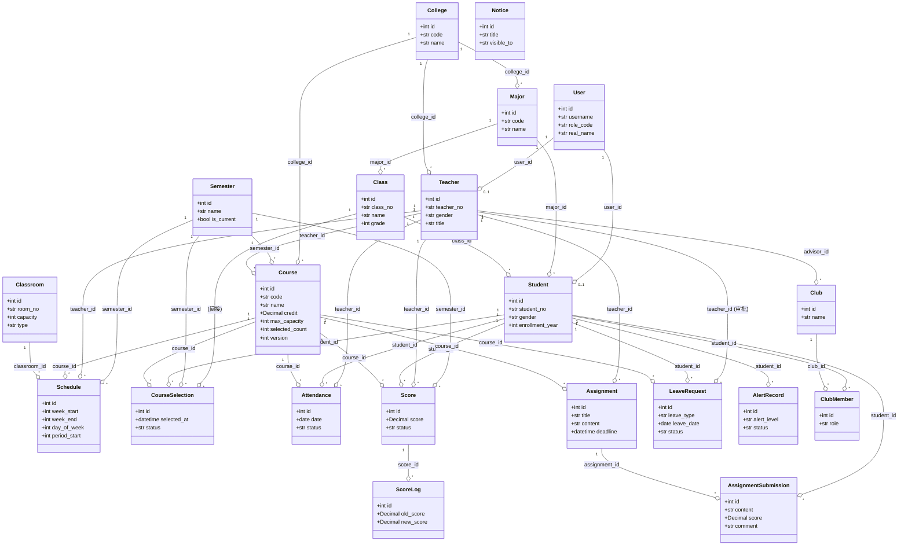
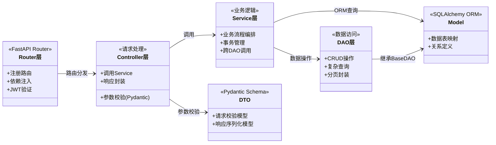

# 类关系图

## 1. 核心实体关系概览

```mermaid
classDiagram
    direction TB

    class User {
        +int id
        +str username
        +str role_code
        +str real_name
    }

    class Teacher {
        +int id
        +str teacher_no
        +str gender
        +str title
    }

    class Student {
        +int id
        +str student_no
        +str gender
        +int enrollment_year
    }

    class College {
        +int id
        +str code
        +str name
    }

    class Major {
        +int id
        +str code
        +str name
    }

    class Class {
        +int id
        +str class_no
        +str name
        +int grade
    }

    class Semester {
        +int id
        +str name
        +bool is_current
    }

    class Course {
        +int id
        +str code
        +str name
        +Decimal credit
        +int max_capacity
        +int selected_count
        +int version
    }

    class Classroom {
        +int id
        +str room_no
        +int capacity
        +str type
    }

    class Schedule {
        +int id
        +int week_start
        +int week_end
        +int day_of_week
        +int period_start
    }

    class CourseSelection {
        +int id
        +datetime selected_at
        +str status
    }

    class Attendance {
        +int id
        +date date
        +str status
    }

    class Score {
        +int id
        +Decimal score
        +str status
    }

    class ScoreLog {
        +int id
        +Decimal old_score
        +Decimal new_score
    }

    class Assignment {
        +int id
        +str title
        +str content
        +datetime deadline
    }

    class AssignmentSubmission {
        +int id
        +str content
        +Decimal score
        +str comment
    }

    class LeaveRequest {
        +int id
        +str leave_type
        +date leave_date
        +str status
    }

    class AlertRecord {
        +int id
        +str alert_level
        +str status
    }

    class Club {
        +int id
        +str name
    }

    class ClubMember {
        +int id
        +str role
    }

    class Notice {
        +int id
        +str title
        +str visible_to
    }

    %% 1:1
    User "1" --o "0..1" Teacher : user_id
    User "1" --o "0..1" Student : user_id

    %% N:1
    College "1" --o "*" Major : college_id
    College "1" --o "*" Teacher : college_id
    College "1" --o "*" Course : college_id
    Major "1" --o "*" Class : major_id
    Major "1" --o "*" Student : major_id
    Class "1" --o "*" Student : class_id
    Class "1" --o "*" CourseSelection : (间接)
    Semester "1" --o "*" Course : semester_id
    Semester "1" --o "*" Schedule : semester_id
    Semester "1" --o "*" CourseSelection : semester_id
    Semester "1" --o "*" Score : semester_id

    Teacher "1" --o "*" Course : teacher_id
    Teacher "1" --o "*" Schedule : teacher_id
    Teacher "1" --o "*" Attendance : teacher_id
    Teacher "1" --o "*" Score : teacher_id
    Teacher "1" --o "*" Assignment : teacher_id
    Teacher "1" --o "*" LeaveRequest : teacher_id (审批)
    Teacher "1" --o "*" Club : advisor_id

    Student "1" --o "*" CourseSelection : student_id
    Student "1" --o "*" Attendance : student_id
    Student "1" --o "*" Score : student_id
    Student "1" --o "*" AssignmentSubmission : student_id
    Student "1" --o "*" LeaveRequest : student_id
    Student "1" --o "*" ClubMember : student_id
    Student "1" --o "*" AlertRecord : student_id

    Course "1" --o "*" Schedule : course_id
    Course "1" --o "*" CourseSelection : course_id
    Course "1" --o "*" Attendance : course_id
    Course "1" --o "*" Score : course_id
    Course "1" --o "*" Assignment : course_id
    Course "1" --o "*" LeaveRequest : course_id

    Classroom "1" --o "*" Schedule : classroom_id

    Assignment "1" --o "*" AssignmentSubmission : assignment_id
    Score "1" --o "*" ScoreLog : score_id
    Club "1" --o "*" ClubMember : club_id
```

## 2. 分层架构关系

```mermaid
classDiagram
    direction LR

    class Router层 {
        <<FastAPI Router>>
        +注册路由
        +依赖注入
        +JWT验证
    }

    class Controller层 {
        <<请求处理>>
        +参数校验(Pydantic)
        +调用Service
        +响应封装
    }

    class Service层 {
        <<业务逻辑>>
        +业务流程编排
        +事务管理
        +跨DAO调用
    }

    class DAO层 {
        <<数据访问>>
        +CRUD操作
        +复杂查询
        +分页封装
    }

    class DTO {
        <<Pydantic Schema>>
        +请求校验模型
        +响应序列化模型
    }

    class Model {
        <<SQLAlchemy ORM>>
        +数据表映射
        +关系定义
    }

    Router层 --> Controller层 : 路由分发
    Controller层 --> Service层 : 调用
    Controller层 --> DTO : 参数校验
    Service层 --> DAO层 : 数据操作
    Service层 --> Model : ORM查询
    DAO层 --> Model : 继承BaseDAO
```

## 3. Service层依赖关系

```mermaid
graph TD
    AuthService["AuthService\n认证服务"]
    UserService["UserService\n用户管理"]
    CollegeService["CollegeService\n学院管理"]
    TeacherService["TeacherService\n教师管理"]
    StudentService["StudentService\n学生管理"]
    CourseService["CourseService\n课程管理"]
    ScheduleService["ScheduleService\n排课服务"]
    SelectionService["SelectionService\n选课服务(高并发)"]
    TimetableService["TimetableService\n课表服务"]
    AttendanceService["AttendanceService\n点名/考勤服务"]
    ScoreService["ScoreService\n成绩服务"]
    AssignmentService["AssignmentService\n作业服务"]
    LeaveService["LeaveService\n请假服务"]
    AlertService["AlertService\n预警服务"]
    ClubService["ClubService\n社团服务"]
    NoticeService["NoticeService\n公告服务"]
    ImportService["ImportService\n导入服务"]

    AuthService --> UserService
    UserService --> TeacherService
    UserService --> StudentService

    CollegeService --> MajorService["MajorService"]
    MajorService --> ClassService["ClassService"]

    ScheduleService --> CourseService
    ScheduleService --> ClassroomService["ClassroomService"]
    ScheduleService --> TeacherService
    ScheduleService --> CeleryTask["Celery异步任务"]

    SelectionService --> CourseService
    SelectionService --> StudentService
    SelectionService --> RedisClient["Redis客户端"]
    SelectionService --> RateLimiter["限流器"]

    TimetableService --> ScheduleService
    TimetableService --> SelectionService

    AttendanceService --> CourseService
    AttendanceService --> StudentService

    ScoreService --> CourseService
    ScoreService --> StudentService

    AssignmentService --> CourseService
    AssignmentService --> StudentService

    LeaveService --> StudentService
    LeaveService --> CourseService
    LeaveService --> TeacherService

    AlertService --> AttendanceService
    AlertService --> ScoreService
    AlertService --> CeleryBeat["Celery定时任务"]

    ImportService --> TeacherService
    ImportService --> StudentService
    ImportService --> UserService
    ImportService --> CeleryTask
```
