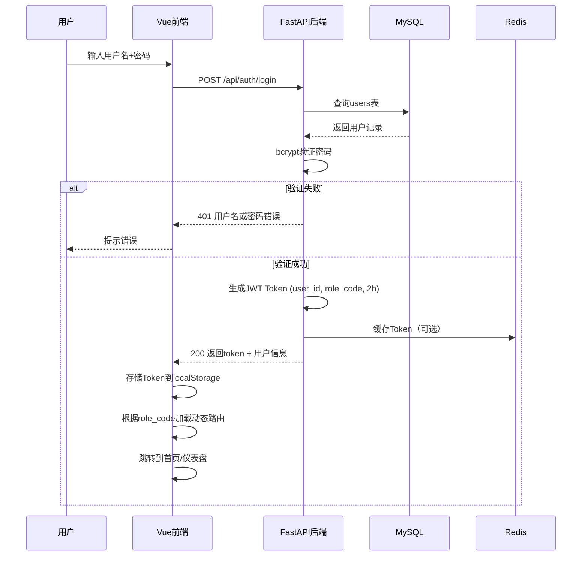
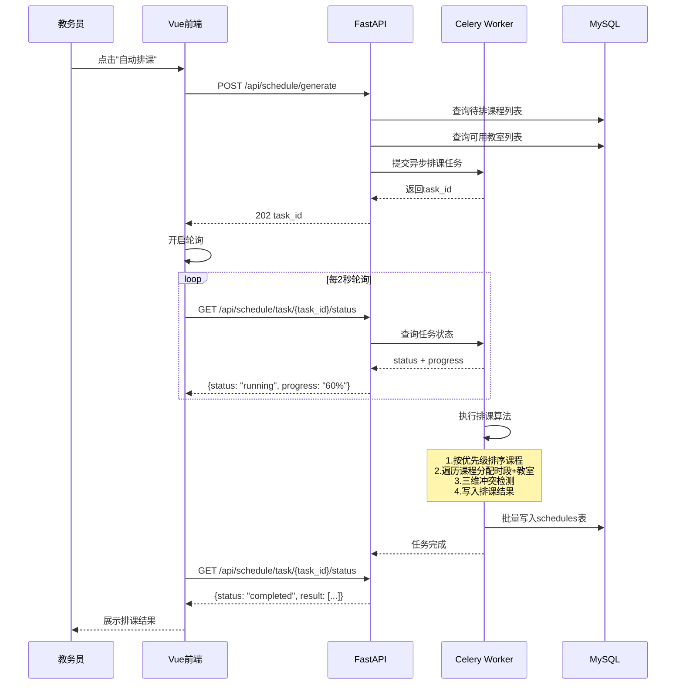
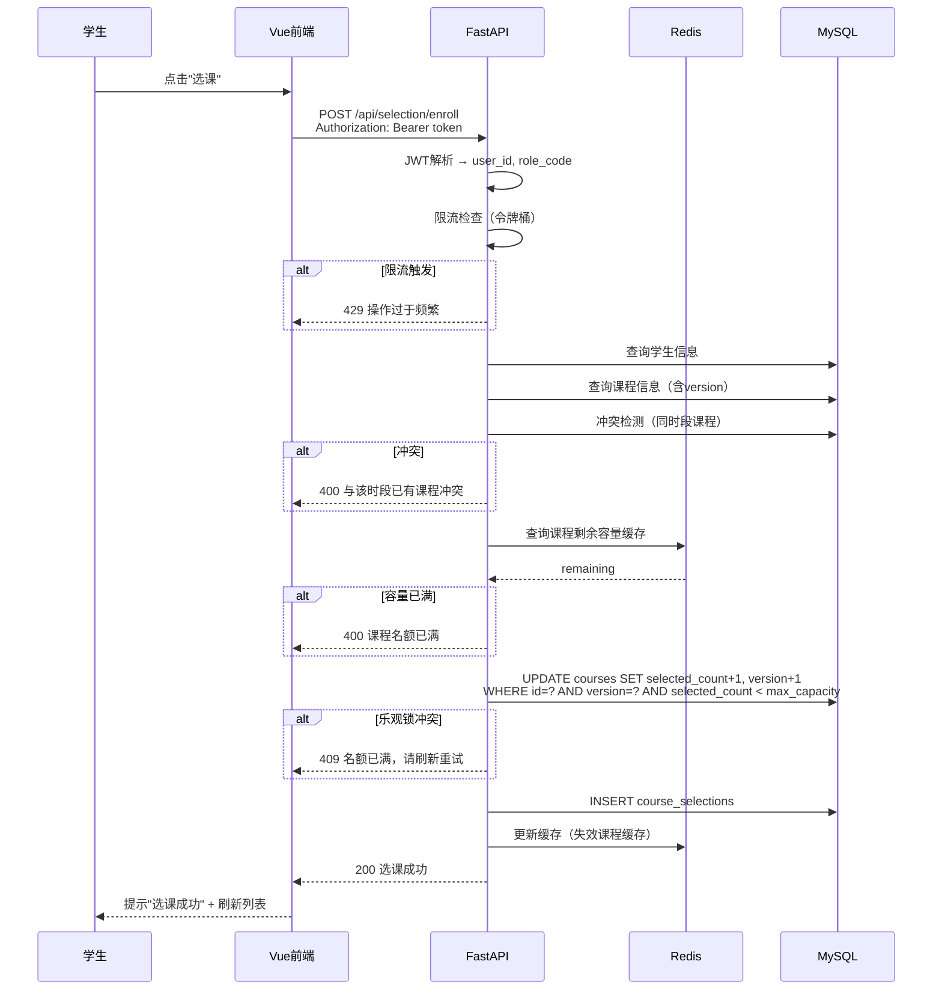
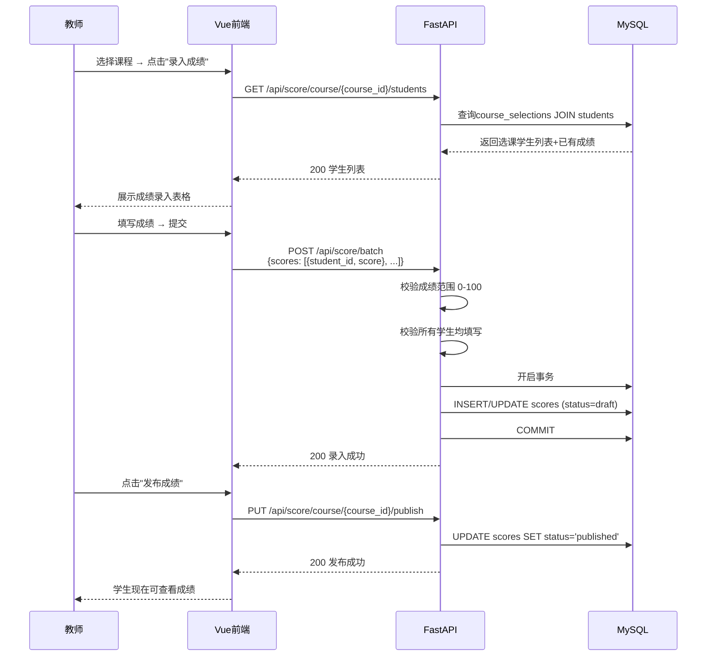
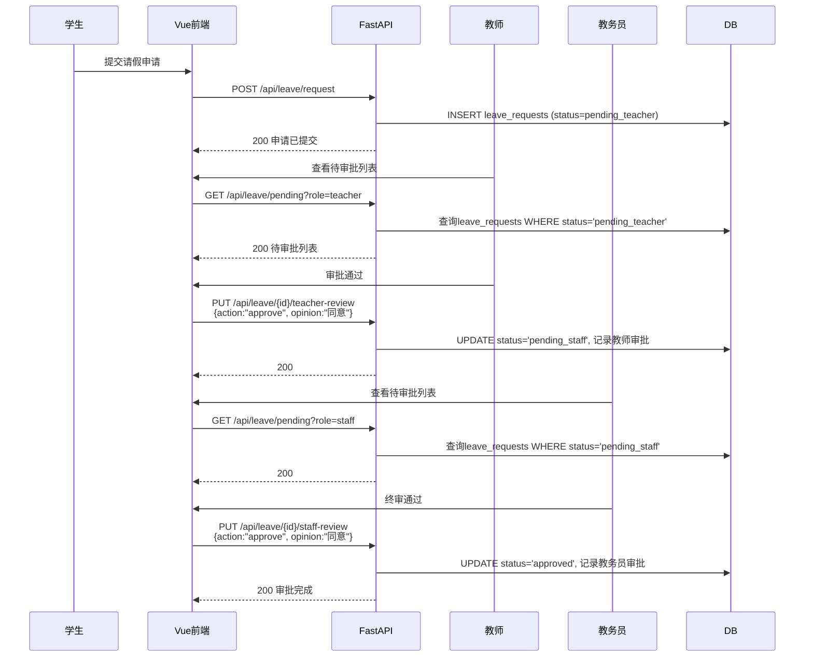
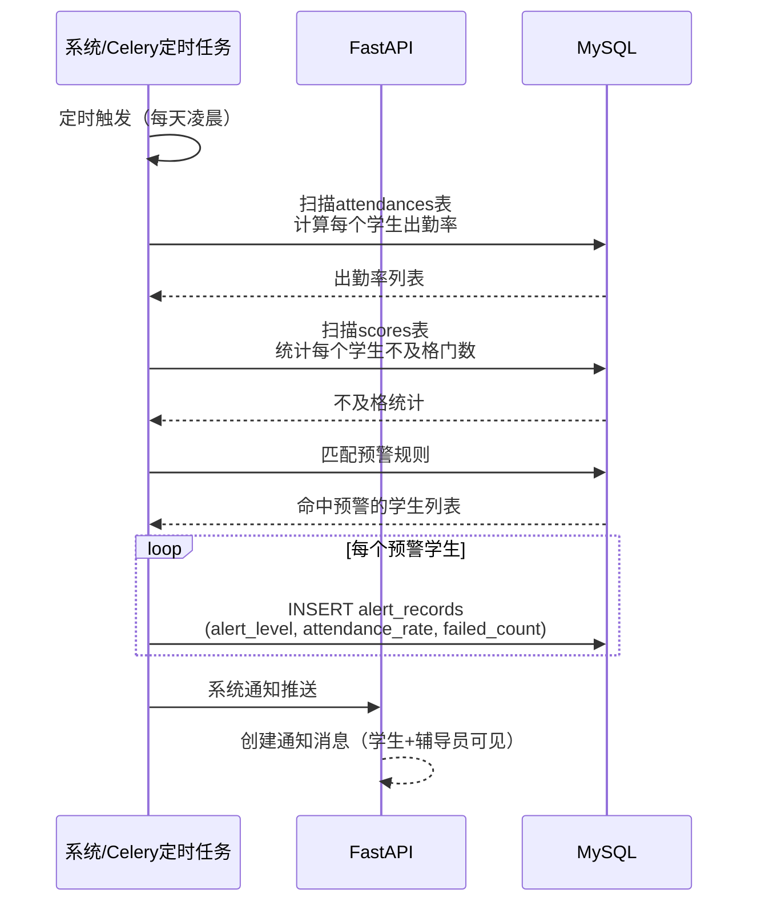

# 核心业务流程

## 1. 用户登录流程

```mermaid
sequenceDiagram
    participant U as 用户
    participant F as Vue前端
    participant B as FastAPI后端
    participant DB as MySQL
    participant R as Redis

    U->>F: 输入用户名+密码
    F->>B: POST /api/auth/login
    B->>DB: 查询users表
    DB-->>B: 返回用户记录
    B->>B: bcrypt验证密码
    alt 验证失败
        B-->>F: 401 用户名或密码错误
        F-->>U: 提示错误
    else 验证成功
        B->>B: 生成JWT Token (user_id, role_code, 2h)
        B->>R: 缓存Token（可选）
        B-->>F: 200 返回token + 用户信息
        F->>F: 存储Token到localStorage
        F->>F: 根据role_code加载动态路由
        F->>F: 跳转到首页/仪表盘
    end
```

## 2. 排课流程

```mermaid
sequenceDiagram
    participant S as 教务员
    participant F as Vue前端
    participant B as FastAPI
    participant C as Celery Worker
    participant DB as MySQL

    S->>F: 点击"自动排课"
    F->>B: POST /api/schedule/generate
    B->>DB: 查询待排课程列表
    B->>DB: 查询可用教室列表
    B->>C: 提交异步排课任务
    C-->>B: 返回task_id
    B-->>F: 202 task_id
    F->>F: 开启轮询

    loop 每2秒轮询
        F->>B: GET /api/schedule/task/{task_id}/status
        B->>C: 查询任务状态
        C-->>B: status + progress
        B-->>F: {status: "running", progress: "60%"}
    end

    C->>C: 执行排课算法
    Note over C: 1.按优先级排序课程<br/>2.遍历课程分配时段+教室<br/>3.三维冲突检测<br/>4.写入排课结果
    C->>DB: 批量写入schedules表
    C-->>B: 任务完成

    F->>B: GET /api/schedule/task/{task_id}/status
    B-->>F: {status: "completed", result: [...]}
    F-->>S: 展示排课结果
```

## 3. 选课流程（高并发）

```mermaid
sequenceDiagram
    participant S as 学生
    participant F as Vue前端
    participant B as FastAPI
    participant R as Redis
    participant DB as MySQL

    S->>F: 点击"选课"
    F->>B: POST /api/selection/enroll<br/>Authorization: Bearer token
    B->>B: JWT解析 → user_id, role_code
    B->>B: 限流检查（令牌桶）
    
    alt 限流触发
        B-->>F: 429 操作过于频繁
    end

    B->>DB: 查询学生信息
    B->>DB: 查询课程信息（含version）
    B->>DB: 冲突检测（同时段课程）
    
    alt 冲突
        B-->>F: 400 与该时段已有课程冲突
    end

    B->>R: 查询课程剩余容量缓存
    R-->>B: remaining
    
    alt 容量已满
        B-->>F: 400 课程名额已满
    end

    B->>DB: UPDATE courses SET selected_count+1, version+1<br/>WHERE id=? AND version=? AND selected_count < max_capacity
    
    alt 乐观锁冲突
        B-->>F: 409 名额已满，请刷新重试
    end

    B->>DB: INSERT course_selections
    B->>R: 更新缓存（失效课程缓存）
    B-->>F: 200 选课成功
    F-->>S: 提示"选课成功" + 刷新列表
```

## 4. 成绩录入流程

```mermaid
sequenceDiagram
    participant T as 教师
    participant F as Vue前端
    participant B as FastAPI
    participant DB as MySQL

    T->>F: 选择课程 → 点击"录入成绩"
    F->>B: GET /api/score/course/{course_id}/students
    B->>DB: 查询course_selections JOIN students
    DB-->>B: 返回选课学生列表+已有成绩
    B-->>F: 200 学生列表
    F-->>T: 展示成绩录入表格

    T->>F: 填写成绩 → 提交
    F->>B: POST /api/score/batch<br/>{scores: [{student_id, score}, ...]}
    B->>B: 校验成绩范围 0-100
    B->>B: 校验所有学生均填写
    B->>DB: 开启事务
    B->>DB: INSERT/UPDATE scores (status=draft)
    B->>DB: COMMIT
    B-->>F: 200 录入成功

    T->>F: 点击"发布成绩"
    F->>B: PUT /api/score/course/{course_id}/publish
    B->>DB: UPDATE scores SET status='published'
    B-->>F: 200 发布成功
    F-->>T: 学生现在可查看成绩
```

## 5. 请假审批流程

```mermaid
sequenceDiagram
    participant S as 学生
    participant F as Vue前端
    participant B as FastAPI
    participant T as 教师
    participant A as 教务员

    S->>F: 提交请假申请
    F->>B: POST /api/leave/request
    B->>DB: INSERT leave_requests (status=pending_teacher)
    B-->>F: 200 申请已提交

    T->>F: 查看待审批列表
    F->>B: GET /api/leave/pending?role=teacher
    B->>DB: 查询leave_requests WHERE status='pending_teacher'
    B-->>F: 200 待审批列表

    T->>F: 审批通过
    F->>B: PUT /api/leave/{id}/teacher-review<br/>{action:"approve", opinion:"同意"}
    B->>DB: UPDATE status='pending_staff', 记录教师审批
    B-->>F: 200

    A->>F: 查看待审批列表
    F->>B: GET /api/leave/pending?role=staff
    B->>DB: 查询leave_requests WHERE status='pending_staff'
    B-->>F: 200

    A->>F: 终审通过
    F->>B: PUT /api/leave/{id}/staff-review<br/>{action:"approve", opinion:"同意"}
    B->>DB: UPDATE status='approved', 记录教务员审批
    B-->>F: 200 审批完成
```

## 6. 学业预警流程

```mermaid
sequenceDiagram
    participant Sys as 系统/Celery定时任务
    participant B as FastAPI
    participant DB as MySQL

    Sys->>Sys: 定时触发（每天凌晨）

    Sys->>DB: 扫描attendances表<br/>计算每个学生出勤率
    DB-->>Sys: 出勤率列表
    
    Sys->>DB: 扫描scores表<br/>统计每个学生不及格门数
    DB-->>Sys: 不及格统计

    Sys->>DB: 匹配预警规则
    DB-->>Sys: 命中预警的学生列表

    loop 每个预警学生
        Sys->>DB: INSERT alert_records<br/>(alert_level, attendance_rate, failed_count)
    end

    Sys->>B: 系统通知推送
    B-->>B: 创建通知消息（学生+辅导员可见）
```
